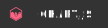

# Hi there 👋

I'm a Software Developer and I'm always looking to learn while contributing to open source applications.  
Feel free to send me a message, I like to talk about everything.

## My main tools

## Also used

## Learning

<!--
**CristianAUnisa/CristianAUnisa** is a ✨ _special_ ✨ repository because its `README.md` (this file) appears on your GitHub profile.

Here are some ideas to get you started:

- 🔭 I’m currently working on ...
- 🌱 I’m currently learning ...
- 👯 I’m looking to collaborate on ...
- 🤔 I’m looking for help with ...
- 💬 Ask me about ...
- 📫 How to reach me: ...
- 😄 Pronouns: ...
- ⚡ Fun fact: ...
-->
